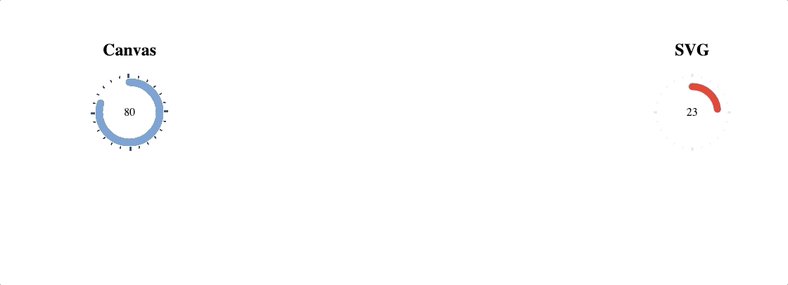

# Easypiechart-v2

This is a rework from the v1 [easy-pie-chart](https://github.com/rendro/easy-pie-chart).
The main reason is to export that **awesome** chart to a module.

It is rewritten in Typescript.

# Renderer

It supports HTML-Canvas and SVG.


# Usage

```html
<div class="chart" data-percent="73">73%</div>

<script src="/path/to/easypiechart.js"></script>
<script>
  var element = document.querySelector(".chart");
  new EasyPieChart(element, {
    // your options goes here
  });
</script>
```

# Options

You can pass these options to the initialize function to set a custom look and feel for the plugin.

<table>
    <tr>
        <th>Property (Type)</th>
        <th>Default</th>
        <th>Description</th>
    </tr>
    <tr>
        <td>Renderer</td>
        <td>Canvas</td>
        <td>Render-Engine in order to output the Chart</td>
    </tr>
    <tr>
        <td><strong>barColor</strong></td>
        <td>#ef1e25</td>
        <td>The color of the curcular bar. You can either pass a valid css color string, or a function that takes the current percentage as a value and returns a valid css color string.</td>
    </tr>
    <tr>
        <td><strong>trackColor</strong></td>
        <td>#f2f2f2</td>
        <td>The color of the track, or false to disable rendering.</td>
    </tr>
    <tr>
        <td><strong>scaleColor</strong></td>
        <td>#dfe0e0</td>
        <td>The color of the scale lines, false to disable rendering.</td>
    </tr>
    <tr>
        <td><strong>scaleLength</strong></td>
        <td>5</td>
        <td>Length of the scale lines (reduces the radius of the chart).</td>
    </tr>
    <tr>
        <td><strong>lineCap</strong></td>
        <td>round</td>
        <td>Defines how the ending of the bar line looks like. Possible values are: <code>butt</code>, <code>round</code> and <code>square</code>.</td>
    </tr>
    <tr>
        <td><strong>lineWidth</strong></td>
        <td>3</td>
        <td>Width of the chart line in px.</td>
    </tr>
    <tr>
        <td><strong>size</strong></td>
        <td>110</td>
        <td>Size of the pie chart in px. It will always be a square.</td>
    </tr>
        <tr>
        <td><strong>rotate</strong></td>
        <td>0</td>
        <td>Rotation of the complete chart in degrees.</td>
    </tr>
    <tr>
        <td><strong>animate</strong></td>
        <td>object</td>
        <td>Object with time in milliseconds and boolean for an animation of the bar growing (<code>{ duration: 1000, enabled: true }</code>), or false to deactivate animations.</td>
    </tr>
    <tr>
        <td><strong>easing</strong></td>
        <td>defaultEasing</td>
        <td>Easing function or string with the name of a <a href="http://gsgd.co.uk/sandbox/jquery/easing/" target="_blank">jQuery easing function</a></td>
    </tr>
</table>

# Development

[Parcel](https://parceljs.org/) is used for the bundling which bundles the TS-Files in the `src`- folder.
By simply using the `npm run build` command, it generates a `easyPieChart.js` in the `dist`- folder.

**Note:** Please, notice the camelcasing!

## Get Started

```
npm i
npm run start
```

For now, I have pointed in the JS-File `app.js` to the `dist`- Folder and its `easyPieChart.js`.
For **Development**, you should point to the `src/easyPieChart.ts` in `app.js`.

```
<script src="src/easyPieChart.ts"></script>
```

## Test

TODO: Jest
